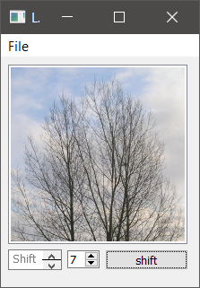
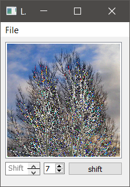
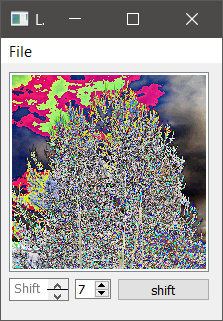
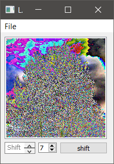
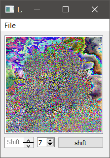
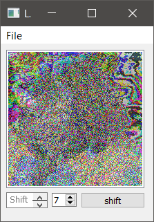
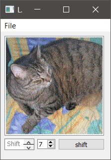
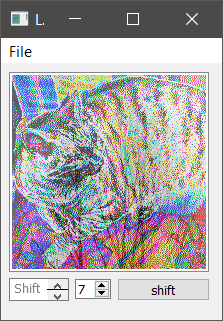

# littlebit
The qt program for shifting values of pixels.

## Example
src:
> https://commons.wikimedia.org/wiki/File:Steganography_original.png
> By The original uploader was Cyp at English Wikipedia. [GFDL (http://www.gnu.org/copyleft/fdl.html) or CC-BY-SA-3.0 (http://creativecommons.org/licenses/by-sa/3.0/)], via Wikimedia Commons

       
